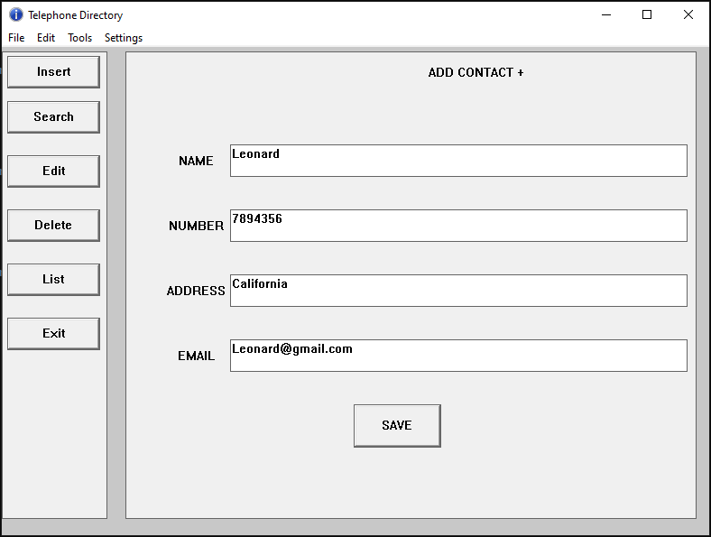
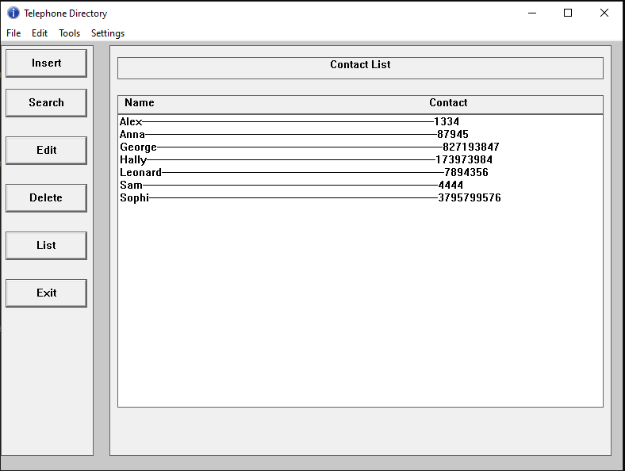
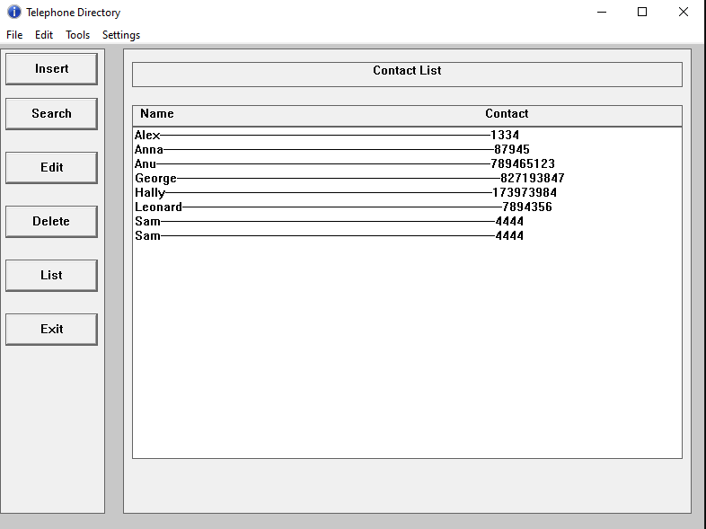
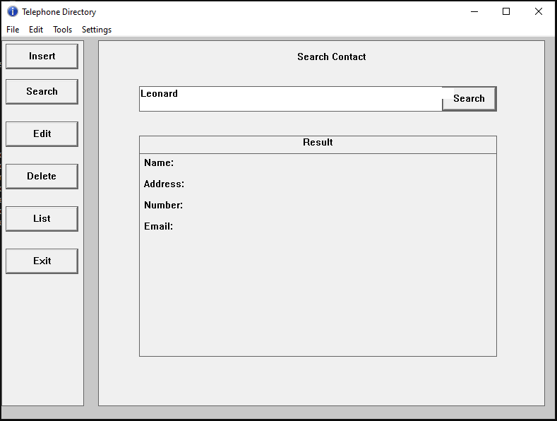
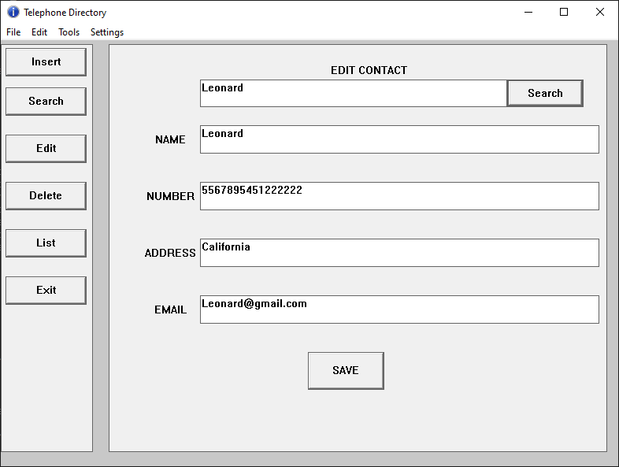
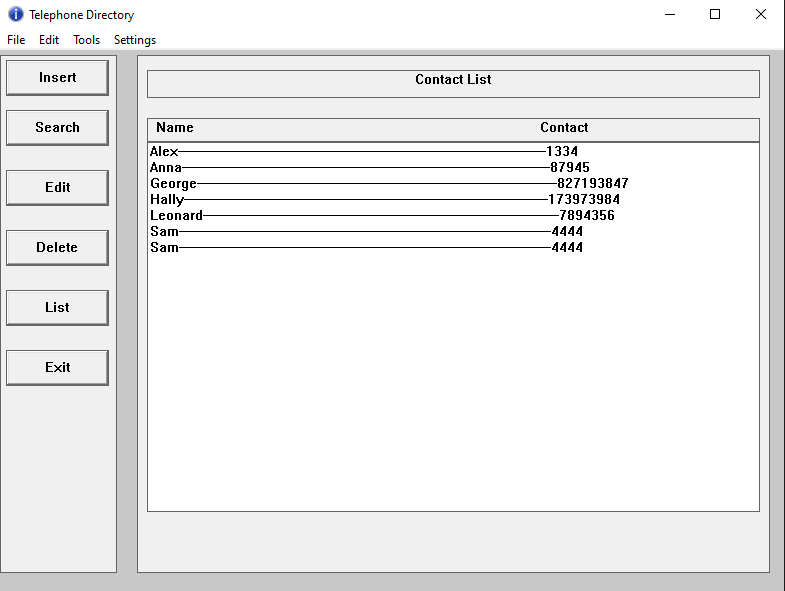
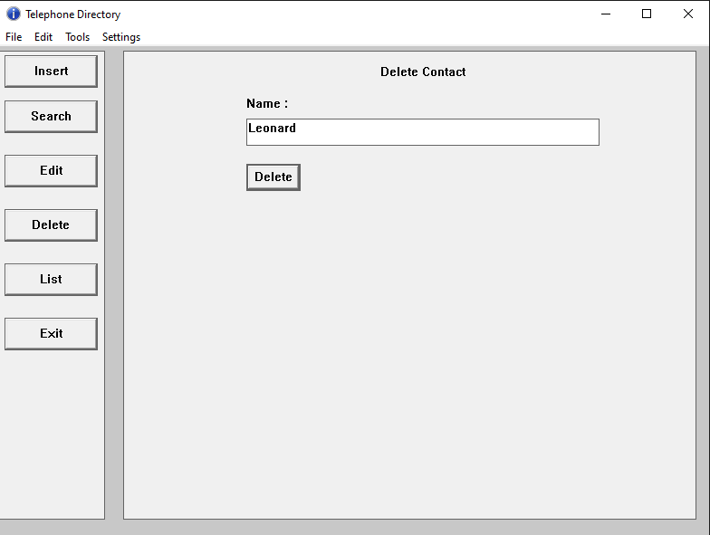
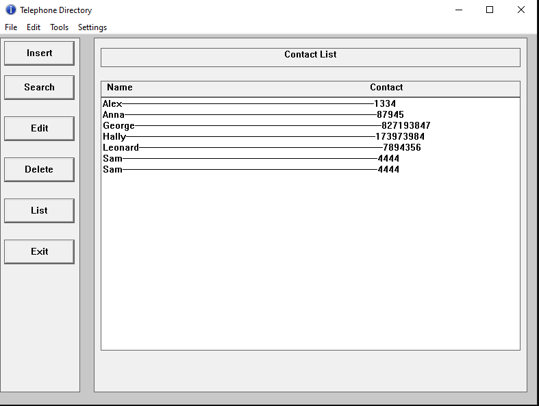

# Telephone Directory
This project demonstrates the working of **B-Tree** (The B-Tree used here is of order 5). The GUI is made using **Win32 API**. Through GUI, name and phone number (email, address are optional) of an individual are provided, and those records are recorded in the node of tree arranged accordingly by name in dictionary order.

## Insertion
The contact information to be recorded are provided through GUI. And at the backend, it gets recorded as a node of B-Tree arranged by name in dictionary order.

After the save button is clicked, the information get stored as a node of Tree. The list of contacts can be observed clicking *List* button. 

The *List* page shows all the contacts with name and phone number in aphabetical order.

There may come a ambiguity; if first character of two or more contact's name is same, it arranges accordingly by the second character of a name, and so forth.

(_Here the contact Alex, Anna and Anu starts with the same alphabet 'A'. In such case, it is arranged using the second alphabet of name and so forth. And if the whole name is same, both are stored with same name._) 

## Searching
For searching, it does as it in binary tree; starts with the root node, compare and goes to left or right node accordingly until the result is found or reached at the end.

  
   

## Editing
The information of an individual can be changed too. For that, B-Tree search is done and the content is accessed and edited.

After the content is changed, the *List* page shows the edited content.

## Deletion
Individual key/block of the node of B-Tree can be removed. The Deletion button remove the desired contact and rearrange all the contacts.

  
   

## Apendix
This project is made in CPP and Wind32 API using codeblocks. If anyone wants to run this project; just import in codeblock and run it.

